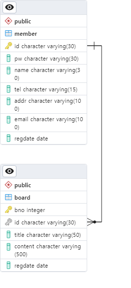
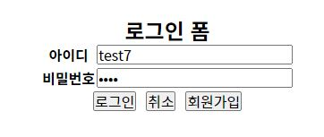

# 프로젝트
## 프로젝트 개요
떼루아 와인아울렛을 모델로 재설계하였다
java(1.8 ver), css , html 등을 활용하였고
해당 프로젝트는 메인페이지,서브페이지6개 와 회원가입 , 회원 탈퇴 , 회원정보 수정 , 로그인 ,로그아웃
글쓰기 , 글 수정 , 글삭제 , 관리자용 관리페이지 등으로 작성되었고
회원은 자신의 정보를 수정및 삭제할수 있는 마이페이지의 기능을 구현하였고
관리자는 회원들의 정보와 게시판을 관리할수있는 관리자 페이지 기능을 구현하였다

## 개념적설계
### 요구사항
1. 홈페이지의 전반적인 기능을 수행가능하여야한다
2. 회원 가입 기능을 구현한다
3. 공지사항을 읽거나 쓰려면(게시판) 로그인을 하여야한다
4. 본인 외의 글은 삭제 혹은 수정할수 없다
5. 관리자 페이지를 따로 만들어야한다
6. 관리자는 게시판과 회원을 관리할수 있어야한다
7. 관리자는 모든 게시글을 수정 및 삭제가 가능하여야한다
8. 관리자는 회원의 정보를 수정 및 삭제가 가능하여야한다
9. 회원은 자신계정을 볼수있어야한다 (마이페이지기능)
10. 회원은 자신계정을 수정할수 있어야한다
11. 회원은 탈퇴가 가능하여야한다

### 유스케이스다이어그램

## 논리적설계
### 논리적검증

### 논리적ERD

## 물리적설계
### 물리적설계표

### 테이블ERD

# 기능 구현 및 메뉴얼

메인화면(index.jsp) -> 아울렛소개(sub1.jsp) / 공지사항(board/sub2.jsp) / 한정수량 초특가(sub3.jsp) / 이달의특가(sub4.jsp) / 이달의와인(sub5.jsp) / 고객지원(sub6.jsp)

### 회원기능

회원가입 - > 약관 페이지(login/agreement.jsp) -> 회원 가입 폼(login/join.jsp) -> 아이디중복확인 (login/idCheck.jsp) -> 회원가입처리(login/joinpro.jsp) -> 로그인페이지(login/login.jsp)

로그인 -> 로그인폼(login/login.jsp) -> 로그인처리(login/loginpro.jsp) -> 메인화면(index.jsp)

회원정보 수정 -> 마이페이지(login/mypage.jsp) -> 회원정보수정페이지(login/update.jsp) -> 수정확인(login/updatePro.jsp)-> 마이페이지(login/mypage.jsp)

회원탈퇴    -> 마이페이지(login/mypage.jsp) -> 회원정보수정페이지(login/update.jsp) -> 회원탈퇴(login/deletePro.jsp) -> 로그인페이지(login/login.jsp)

회원의 글쓰기는 어디까지나 테스트적인 면에서 로그인 한 회원도 글을쓸수 있고 자신의 글(다른사람은 불가)을 수정 할수 있는 기능해 놓았다
글쓰기 -> 공지사항(board/sub2.jsp) -> 글쓰기(board/noticeInsert.jsp) -> 글쓰기확인(board/noticeInsertPro.jsp) -> 공지사항board/sub2.jsp)

글수정 -> 공지사항(board/sub2.jsp) -> 글 자세히 (board/subDetail.jsp) -자신의글만 가능함- -> 수정하기(board/subUpdate.jsp) -> 수정(board/subUpdatePro.jsp) -> 수정한 게시글 (board/subDetail.jsp)

글삭제 -> 공지사항(board/sub2.jsp) -> 글 자세히 (board/subDetail.jsp) -자신의글만 가능함- -> 수정하기(board/subUpdate.jsp) -> 글 삭제(board/deletePro.jsp) -> 게시글목록 (board/sub2.jsp)

### 관리자기능
관리자로그인 -> 로그인폼(login/login.jsp) -> 로그인처리(login/loginpro.jsp) -> 메인화면(index.jsp)
*관리자로 로그인을 하면 우측상단 마이페이지 부분에 관리자모드기능과 나가기가 생김

회원관리 ->  관리자모드(admin/adminpage.jsp) -> 회원관리(admin/adminUsers.jsp)

회원정보수정 ->  관리자모드(admin/adminpage.jsp) -> 회원관리(admin/adminUsers.jsp) -> 회원정보수정(admin/adminupdate.jsp) -> 회원관리페이지(admin/adminUsers.jsp)

회원삭제 -> 관리자모드(admin/adminpage.jsp) -> 회원관리(admin/adminUsers.jsp) -> 회원정보삭제(admin/admindeletePro.jsp) -> 회원관리페이지(admin/adminUsers.jsp)

게시글관리 -> 관리자모드(admin/adminpage.jsp) -> 글관리(admin/adminsub2.jsp) 

게시글수정 -> 관리자모드(admin/adminpage.jsp) -> 글관리(admin/adminsub2.jsp) -> 글자세히(admin/adminsubDetail.jsp) -> 글 수정하기(admin/adminsubUpdate.jsp)
    -> 글 수정(adminsubUpdatePro.jsp) -> 글자세히(adminsubDetail.jsp)

게시글삭제 -> 관리자모드(admin/adminpage.jsp) -> 글관리(admin/adminsub2.jsp) -> 삭제(admindeletePro.jsp)

